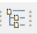
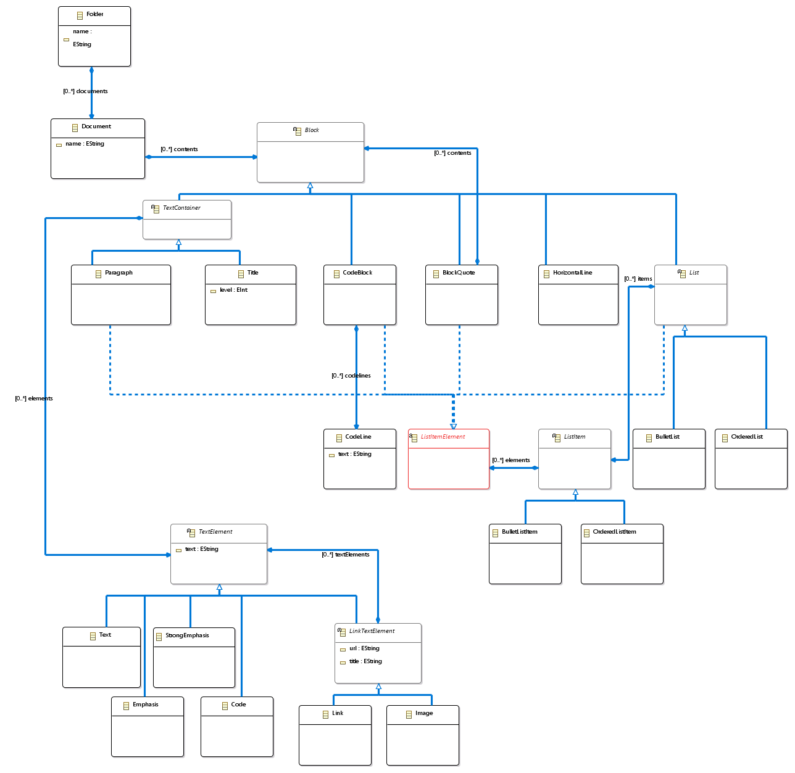
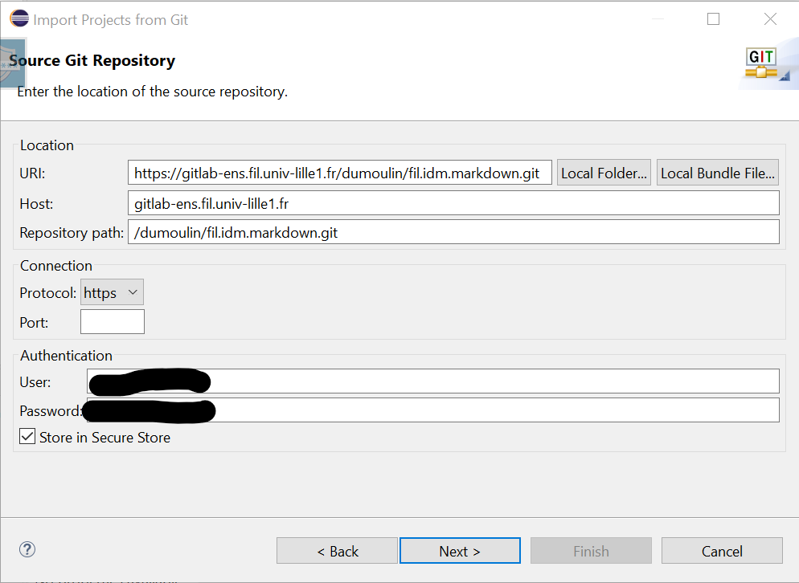
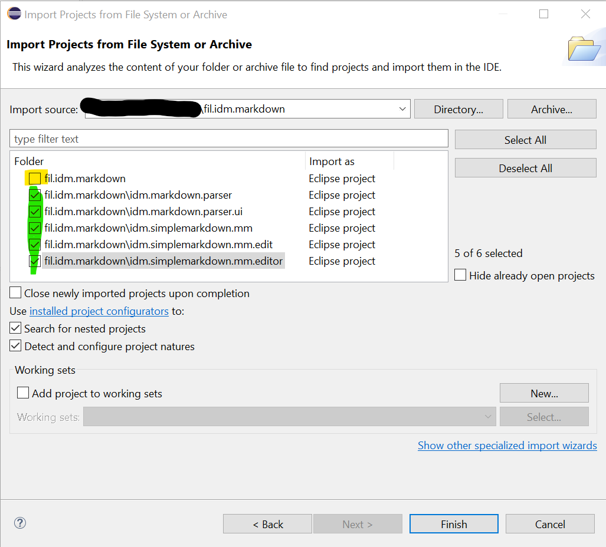
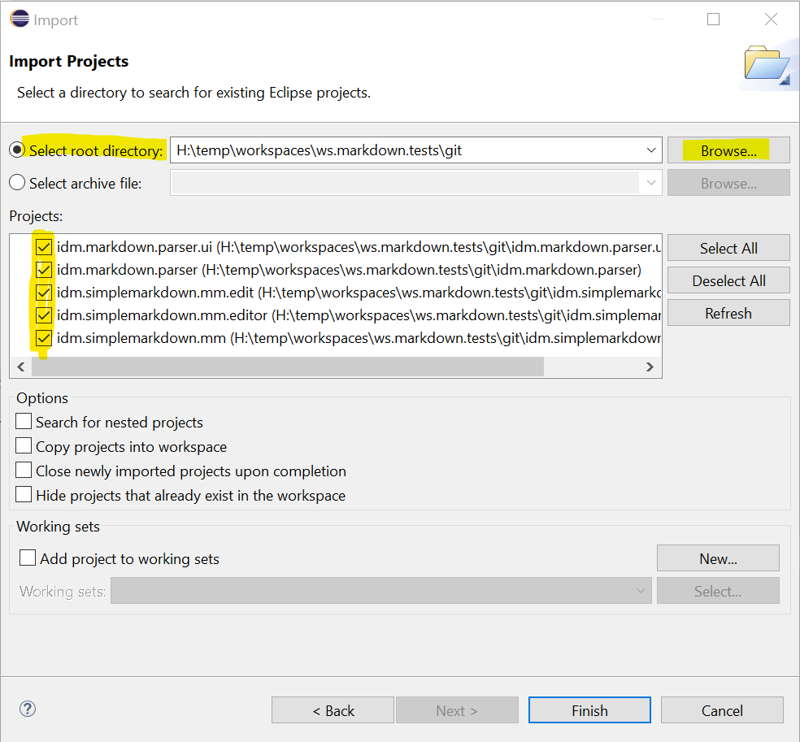

# Mardown file to Mardown Model converter

**Features :**
- A Markdown metamodel in EMF
- A Markdown file to Mardown model converter
- A UI allowing to run the tool from Eclipse menus

# Table of Content

[[_TOC_]]

# GIT repository

https://gitlab-ens.fil.univ-lille1.fr/dumoulin/fil.idm.markdown

# Usages

- Select one or more ``.md`` files, or a directory containing some ``.md`` files.
- ``Right Click -> Markdown -> Markdown Parser``
- Or click the icon  in toolbar.

# Markdown metamodel



# MD Files examples

Some examples in markdown can be found in ``/idm.markdown.parser/src/resources/md``

The following files is used to test the converter.
So, all the markdown constructions found in this file are recognized by the converter, and translated to the model.

**Test file :**

https://gitlab-ens.fil.univ-lille1.fr/dumoulin/fil.idm.markdown/-/blob/master/idm.markdown.parser/src/resources/md/tests.md

# Installation

Actually, the installation can only be done from sources.

## Prerequisites

- Eclipse Modeling (with EMF)


## Installation from sources

To install the tools, downloads all the projects from GIT and import them in an *Eclipse Workspaces*. Then the tools are availables in a second Eclipse launched with  ````Run As -> Eclipse Application````

### Install by importing GIT repository from Eclipse

Copy the GIT URL, then in your Eclipse workbench :
- ``Import... -> Git -> Projects from Git (with smart import)``
- ``Clone URI``
- Set GIT URI, User and Password
- 
- Choose master branch
- Select a location for the local git repo.
  - Avoid a location in the workbench tree
  - Prefer a separate location
  - Check imported projects, unsellect ``fil.idm.markdown`` (this is the root folder, not a project).
- 
- Finish

### Install from a zip file

- Download projects as a zip file
- Uncompress projects at the root of your Eclipse Workspace
- Open Eclipse
- ``Import ... -> General -> Existing Projects into Workspace``
- ``Select root directory``, Browse to the root directory where you have uncompressed your files
- 
